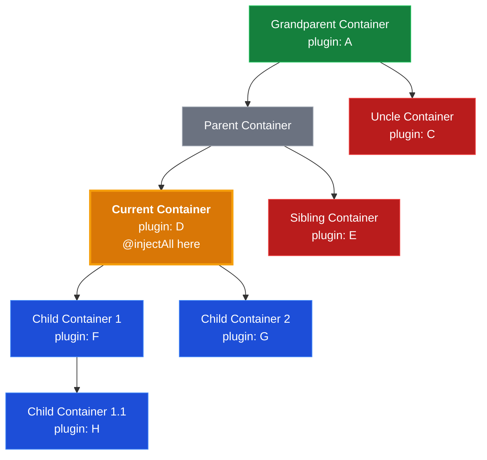

# @injectAll and ResolveScope

Injects arrays of dependencies from container hierarchy. This is how ProxyDI works with collections — each instance with the same semantic dependencyId need to be placed to separate child container with its own dependencies.

By default resolves from children containers only.

ResolveScope allows explicit control over where to search (parent, current, children, or any combination).

## How It Works

`@injectAll` creates permanent Proxy (via `makeInjectAllProxy.ts`) that rebuilds array on each access by calling `resolveAll()`. This means array always reflects current container hierarchy state.

```typescript
@injectable()
class PluginManager {
    @injectAll('plugin') plugins: Plugin[];  // Dynamic array
}
```

`ResolveScope` bitwise enum controls where to search:
- `ResolveScope.Children` - all children recursively (default)
- `ResolveScope.Current` - current container only
- `ResolveScope.Parent` - parent container only
- `ResolveScope.All` - everywhere (parent + current + children)

### Dependency Resolution Graph



**What gets resolved from Current container:**

- `ResolveScope.Children` (Default) → **[F, G, H]** (all children recursively, including nested)
- `ResolveScope.Current` → **[D]** (Current only)
- `ResolveScope.Parent` → **[A]** (searches up hierarchy until found in Grandparent)
- `ResolveScope.All` → **[A, D, F, G, H]** (parent + current + children)

**Cannot access sibling branches** (Uncle, Sibling) — only direct hierarchy line.

## Code Organization

- `injectAll.decorator.ts` — `@injectAll(dependencyId, scope?)` decorator
- `makeInjectAllProxy.ts` — Proxy that calls `resolveAll()` on each access
- `resolveAll.ts` — Recursively resolves dependencies by scope
- `types.ts` — `AllInjection` type and `ResolveScope` enum

## Architectural Decisions

### Why array stays dynamic (never baked)?

Unlike `@inject` single dependencies (auto-bake after first use), `@injectAll` arrays remain Proxy permanently.

**Reason:** Container hierarchy may change, mew children containers added, dependencies registered/removed. Array must reflect current state.

**Trade-off:** Array access slower (~100x) but elements are baked through `container.resolve()`.

`bakeInjections()` skips `@injectAll` — only single injections baked.
\\

### Why no auto-baking array itself?

Elements ARE baked through `container.resolve()` which triggers normal injection Proxy baking. Array itself stays dynamic, but element property access is fast after first use.

## Performance Characteristics

| Component | Performance | Reason |
|-----------|-------------|---------|
| Array access (`plugins.length`) | ~100x slower | Proxy calls `resolveAll()` on every access |
| Element access (`plugins[0].name`) | Fast after first use | Elements baked through `container.resolve()` |
| Adding child container | No impact | Lazy resolution on next array access |

**Recommendation:** Cache array reference if accessing multiple times in loop:
```typescript
const plugins = this.plugins;  // One resolveAll() call
plugins.forEach(p => p.activate());  // Fast
```

Avoid:
```typescript
this.plugins.forEach(p => p.activate());  // resolveAll() on .forEach AND on each iteration
```

## Related Documentation

- [README @injectAll example](../README.md) — user-facing usage
- `injectAll.test.ts` — comprehensive test coverage
- `resolveScope.test.ts` — all scope combinations
- `readme-proposal.test.ts:106-158` — real-world example with Director/Actors
