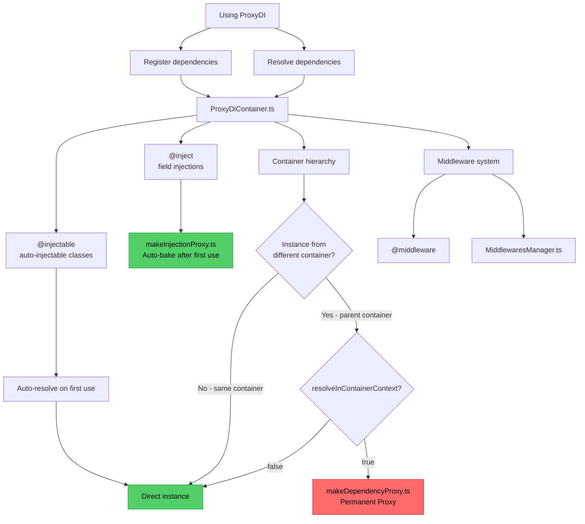

# ProxyDI Developer Documentation

## For AI agents: Before You Start

**MANDATORY reading before working on this project:**

1. **Read the entire [README.md](../README.md)** — understand what the library does and how users interact with it
2. **Read all source files** in `src/` — understand implementation
3. **Read all tests** in `src/__tests__/` — understand expected behavior and edge cases

**This must be done EVERY TIME you work on the project.** ProxyDI is a production library used in other projects. Changes have real impact.

### Running Tests

After code changes, run `npm run coverage`. Maintain 100% coverage for all code branches.

### Updating CHANGELOG

After making changes, update CHANGELOG.md with the appropriate version and changes.

## Documentation Structure

**[Library Users Documentation](../README.md):** for developers using ProxyDI in their projects.

**[Library Developers Documentation](./proxydi.md):** files in this folder (`documentation/`) for contributors working on ProxyDI itself.

## Key Resources

- [How to Write User Documentation](./writing-user-documentation.md) — style guide for user documentation
- [How to Write Developer Documentation](./writing-developer-documentation.md) — style guide for developer project documentation``
- [Roadmap](./roadmap.md) — planned improvements and features
- [Bundler Examples TODO](./bundler-examples-todo.md) — tasks for creating bundler configuration examples

## Architecture Overview

- 🔴 Slow - Permanent Proxy (~100x slower)
- 🟢 Fast - Auto-baked or direct access

## Source Files Overview

**Core:**

- `ProxyDiContainer.ts` — main container implementation
- `types.ts` — TypeScript types and symbols

**Decorators:**

- `inject.decorator.ts` — `@inject` field decorator
- `injectable.decorator.ts` — `@injectable` class decorator

**Proxy Implementation:**

- `makeInjectionProxy.ts` — Proxy for `@inject` fields (auto-bakes after first use)
- `makeDependencyProxy.ts` — Proxy for `resolveInContainerContext` (permanent)

**Middleware:**

- `middleware/middleware.decorator.ts` — `@middleware` decorator
- `middleware/MiddlewaresManager.ts` — middleware lifecycle management
- `middleware/middleware.api.ts` — middleware interfaces

**Utilities:**

- `resolveAll.ts` — resolve dependencies from container hierarchy
- `presets.ts` — default container settings

## Test Files

All tests in `src/__tests__/`:

- `ProxyDiContainer.test.ts` — main container behavior (comprehensive coverage)
- `inject.test.ts` — `@inject` decorator tests
- `injectable.test.ts` — `@injectable` decorator tests
- `readme.test.ts` — examples from README (ensures docs stay correct)

## Architecture Decisions

### Why Proxy?

Enables circular dependency resolution without manual intervention. Different Proxy types have different lifecycle:

- Field injections (`@inject`) — auto-bake after first use (see `makeInjectionProxy.ts:30-32`)
- Context resolution — permanent Proxy (see `makeDependencyProxy.ts`)

### Why `resolveInContainerContext` is disabled by default?

Creates additional permanent Proxy for each parent dependency resolved from child. ~100x slower property access. See `ProxyDiContainer.ts:268-278`.

### Why `register(instance, Class)` is forbidden?

TypeScript overloads distinguish class constructors from instances. Conditional type `T extends new (...args: any[]) => any ? never : T` prevents ambiguity. See `ProxyDiContainer.ts:120-127`.

## Performance Characteristics

| Feature                       | Proxy Type      | Baking                 | Performance Impact |
| ----------------------------- | --------------- | ---------------------- | ------------------ |
| `@inject` fields (default)    | InjectionProxy  | Auto-bake on first use | Minimal (one-time) |
| `@inject` fields (rewritable) | InjectionProxy  | Never                  | ~100x slower       |
| `resolveInContainerContext`   | DependencyProxy | Never                  | ~100x slower       |

See performance tests in `ProxyDiContainer.test.ts:962-994` (commented out).

## Related Projects

- [@proxydi/react](https://github.com/proxy-di/proxydi-react) — React wrapper
- [node-babel-examples](https://github.com/proxy-di/node-babel-examples) — Babel configuration examples
- [node-ts-examples](https://github.com/proxy-di/node-ts-examples) — TypeScript examples

## Contributing

Before making changes:

1. Read this document
2. Read [How to Write Documentation](./writing-documentation.md)
3. Check [README Improvement Proposals](./documentation-improvement-proposals.md) for planned changes
4. Ensure all tests pass
5. Update documentation if behavior changes
6. Add tests for new features

This is a production library. Be careful.
