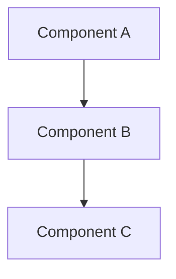

# How to Write Developer Documentation

Developer documentation in `documentation/` folder. For contributors working on ProxyDI itself.

## Language

English. Technical audience familiar with TypeScript and DI concepts.

## Tone

Direct and technical. Focus on architectural decisions and trade-offs.

## What to Document

**Architectural decisions:**
- Why something is designed this way
- What alternatives were considered
- Trade-offs made

**Non-obvious behavior:**
- Performance implications
- Edge cases
- Lifecycle and timing

**Code organization:**
- How files relate to each other
- Where to find specific functionality
- Dependencies between components

## What NOT to Document

- Implementation details visible in code
- What functions do (that's for code comments)
- How to use the library (that's for README)
- Things that duplicate README

## Writing Style

**Be concise.** One sentence if possible. No filler words.

**Focus on "why", not "what".** Code shows what, docs explain why:
```markdown
✅ Good: "contextResolve() creates permanent Proxy (~100x slower) — use sparingly"
❌ Bad: "contextResolve() is a method in the container"
```

**Reference code directly:**
```markdown
✅ Good: "See `ProxyDiContainer.ts:268-278` for implementation"
❌ Bad: "The container class implements this feature"
```

**Explain trade-offs:**
```markdown
✅ Good:
- ✅ Use default settings (auto-baking)
- ❌ Avoid allowRewriteDependencies in production (~100x slower)

❌ Bad: "You can enable allowRewriteDependencies if needed"
```

## Code References

Always link to specific files and lines:

```markdown
✅ Good: "Proxy types (see `makeInjectionProxy.ts:30-32`)"
❌ Bad: "Injection proxies are auto-baked"
```

Format: `filename.ts:line` or `filename.ts:start-end`

## Documentation Links

Integrate links into text:

```markdown
✅ Good: "Container [resolves dependencies](../README.md#resolving) from hierarchy"
❌ Bad: "Container resolves dependencies. See README for details."
```

Link to:
- Specific README sections for user-facing behavior
- Test files for usage examples
- Source files for implementation
- Other developer docs for related topics

## Performance Documentation

Always explain performance implications for non-obvious decisions:

```markdown
### Why X is disabled by default?

Creates additional Proxy for each Y. ~100x slower property access.

**When to use:** [specific scenarios]
**When NOT to use:** [common cases where it's overkill]

See `file.ts:lines` for implementation.
```

## Structure

Every developer doc should have:

1. **Brief description** — what and why (1-2 sentences)
2. **How it works** — architectural overview, no impl details
3. **Code references** — specific files and lines
4. **Trade-offs** — why this way, alternatives, limitations
5. **Related docs** — links to related documentation

## Example Structure

```markdown
# Feature Name

Brief description of what this is and why it exists.

## How It Works

High-level explanation of the approach.

[Diagram if helpful for understanding]

## Code Organization

- `file1.ts` — role/purpose
- `file2.ts` — role/purpose

## Architectural Decisions

### Why approach X?

Explanation with code references.

### Why not approach Y?

Trade-off explanation.

## Performance Characteristics

Impact and recommendations.

## Related Documentation

Links to README sections, other dev docs, etc.
```

## Diagrams

Use Mermaid diagrams **only** when visualization clarifies architecture better than text.

After diagram: **don't repeat it in text**. Diagram shows everything.



Legend if colors/styles have meaning.

## Don't Repeat README

If something is already in README — link to it, don't repeat:

```markdown
✅ Good: "See [README](../README.md#injectable-classes) for @injectable usage"
❌ Bad: [Copy-paste explanation from README]
```

## Testing References

Instead of showing examples, reference tests:

```markdown
✅ Good: "See `ProxyDiContainer.test.ts:731-773` for complete examples"
❌ Bad: [Copy-paste test code into docs]
```

## Reference

See [Radnyk One documentation guide](../../vscode-radnyk-one/docs/writing-documentation.md) for general documentation principles.
